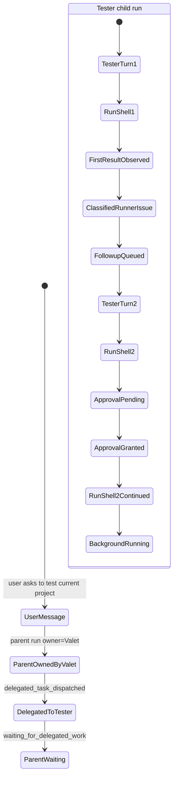
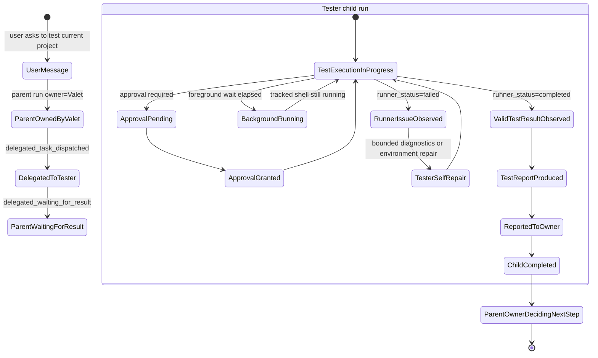

# ADR-022: Tester Runner Contract

**Status**: Accepted
**Date**: 2026-05-20
**Decision makers**: BOSS + Catown Runtime

## Context

Tester delegated work currently executes ordinary shell commands and lets the LLM decide
what the result means. This caused a bad loop in task #45:

- the first pytest command completed with `5 failed, 764 passed`;
- the result was a valid test result, but the agent treated it as an intermediate signal;
- Tester asked for a second full pytest run to get more detail;
- the approval/replay path then ran concurrently with tracked-process reconciliation.

The problem is not only "Tester chose the wrong next step." The runtime had no stable
contract separating "the test runner executed reliably" from "the product passed tests."
Both were collapsed into generic tool success/failure text.

## Decision

Catown will treat delegated Tester execution as a test-runner contract, not as free-form
shell output.

The runtime must distinguish two statuses:

- `runner_status`: whether the test runner/script itself executed reliably enough to
  produce a test result.
- `test_status`: whether the tested system passed, failed, errored, or remains unknown.

Tester may self-handle only runner/script/environment problems. If the runner completed
and produced a valid test result, Tester must produce `test_report` and return ownership
to the parent owner. It must not start another full test run merely to improve report
detail.

## Contract

A test runner result has this normalized shape:

```json
{
  "kind": "test_runner_result",
  "version": 1,
  "framework": "pytest",
  "runner_status": "completed",
  "test_status": "failed",
  "exit_code": 1,
  "counts": {
    "passed": 764,
    "failed": 5,
    "errors": 0,
    "skipped": null
  },
  "environment_errors": [],
  "failure_summary": "...",
  "raw_output_preview": "..."
}
```

`runner_status=completed` means the test runner reached a parseable result boundary:
for pytest, examples include a progress line reaching completion, named failures/errors,
or a short summary with passed/failed/error counts.

`runner_status=failed` means the runner or environment prevented reliable test execution,
for example command not found, invalid cwd, dependency import failure before collection,
pytest collection failure, fixture infrastructure failure, permission failure, or no
parseable test result.

## Policy

When `runner_status=completed`:

- `test_status=passed`: produce a passing `test_report`.
- `test_status=failed` or `errored`: produce a failing/blocking `test_report`.
- Parent owner decides the next action.
- Tester does not rerun the full suite unless the parent explicitly asks.

When `runner_status=failed`:

- Tester may do bounded self-repair or bounded diagnostics.
- The self-repair must target the runner/environment/script problem, not the product.
- If self-repair cannot establish a valid runner result, Tester reports a runner issue.

When the output is inconclusive:

- Tester must not start another full suite automatically.
- The runtime may ask the parent owner to decide whether more evidence is worth the cost.

## Command Strategy

Default test commands should include useful diagnostics on the first run, while keeping
output bounded. For pytest, the default backend command should include short traceback
and failure/error report details:

```bash
python -m pytest backend/tests -q --tb=short --disable-warnings -r fE
```

Large follow-up diagnostics should prefer precise reruns of failed tests, not another
full-suite run.

## Consequences

- Tester completion is based on a software contract, not prompt compliance.
- A test failure is no longer automatically fed back to Tester as an invitation to
  continue the LLM/tool loop.
- Approval replay must not be the mechanism that decides whether a delegated testing
  task continues; the test-runner contract decides whether Tester owns more work.
- Frontend cards can display stable facts from the contract instead of vague progress
  text.

## Runtime State Model

The delegated testing path is a runtime-owned state machine. The user-visible chat and
task cards may summarize it, but they must not invent or infer missing states.

### Current problematic flow

The following is the factual shape that appeared in chat `#3` during the 2026-05-21
testing loop. It is included here as a failure reference, not as the target design.



This flow is wrong because the first failed pytest result was a valid test result but was
classified as a runner issue, so the child did not produce `test_report` and did not
return ownership to the parent owner.

### Target flow



The target rule is strict:

- once a valid test result exists, Tester must produce `test_report`;
- once `test_report` exists, it must be reported to the parent owner;
- once reported, the child run is completed;
- only the parent owner decides whether more testing is needed.

## State Definitions

The delegated Tester state machine uses these backend facts:

- `delegated_waiting_for_result`
  - Meaning: the parent owner has delegated testing work and is waiting for a required
    result such as `test_report`.
  - Owner: parent run.
  - Exit condition: required result is reported, or the work is explicitly blocked,
    failed, cancelled, or returned to the parent.

- `test_execution_in_progress`
  - Meaning: Tester currently owns execution of the test task and no valid terminal test
    result has been observed yet.
  - Owner: child Tester run.
  - Includes active foreground tool execution and tracked background shell execution.

- `approval_pending`
  - Meaning: a concrete tool call exists, it is blocked by approval, and execution has
    not resumed yet.
  - This is a real state because a queue item exists as a durable fact.

- `background_running`
  - Meaning: the shell command is still executing after the foreground wait window ended.
  - This is not a terminal result and not a reason to create a new LLM decision round by
    itself.
  - The runtime must keep observing the tracked process until completion.

- `runner_issue_observed`
  - Meaning: the runner contract determined `runner_status=failed`.
  - Examples: command not found, invalid cwd, dependency import failure before reliable
    execution, pytest collection failure, broken fixture infrastructure, or other
    environment/setup faults that prevent a valid test result.

- `valid_test_result_observed`
  - Meaning: the runner contract determined `runner_status=completed`.
  - The test result may still be `passed`, `failed`, or `errored`, but it is valid test
    evidence and no longer belongs to Tester retry policy.

- `test_report_produced`
  - Meaning: the system has materialized the required `test_report` output from the valid
    test result.
  - The report may be assembled by backend contract logic plus agent-authored summary, but
    it must exist as a durable result object/message rather than hidden follow-up context.

- `reported_to_owner`
  - Meaning: the child result has been explicitly handed back to the parent owner through
    the chat/task routing path.
  - This is not satisfied by hidden extra context alone.

- `owner_deciding_next_step`
  - Meaning: the child has completed its bounded obligation and ownership has returned to
    the parent owner for the next decision.

## Transition Rules

The following transitions are allowed:

1. `delegated_waiting_for_result -> test_execution_in_progress`
   - Trigger: delegated child run starts.

2. `test_execution_in_progress -> approval_pending`
   - Trigger: a specific tool call is blocked by approval.

3. `approval_pending -> test_execution_in_progress`
   - Trigger: the same blocked tool call is approved and resumed.

4. `test_execution_in_progress -> background_running`
   - Trigger: the foreground wait elapses but the tracked shell is still running.

5. `background_running -> test_execution_in_progress`
   - Trigger: runtime watcher continues observing the same tracked shell.
   - Note: this is not a new LLM turn. It is continued execution of the same tool fact.

6. `test_execution_in_progress -> runner_issue_observed`
   - Trigger: normalized runner result yields `runner_status=failed`.

7. `runner_issue_observed -> test_execution_in_progress`
   - Trigger: Tester performs bounded self-repair or bounded diagnostics aimed at runner
     reliability, not product re-testing.

8. `test_execution_in_progress -> valid_test_result_observed`
   - Trigger: normalized runner result yields `runner_status=completed`.

9. `valid_test_result_observed -> test_report_produced`
   - Trigger: required testing output is built and stored as a durable report.

10. `test_report_produced -> reported_to_owner`
    - Trigger: explicit child-to-parent result handoff is recorded.

11. `reported_to_owner -> owner_deciding_next_step`
    - Trigger: parent owner receives the required result.

12. `reported_to_owner -> child completed`
    - Trigger: child run has fulfilled its contract and no longer owns further action.

The following transitions are forbidden:

- `valid_test_result_observed -> test_execution_in_progress` for a new full-suite run
  without explicit parent-owner request.
- `background_running -> owner_deciding_next_step` without a final observed tool result.
- `runner_issue_observed -> reported_to_owner` as if a valid `test_report` already
  existed.
- `parent waiting -> completed` before the required child result exists.

## Classification Boundary

The runtime should prefer software classification over open-ended prompt inference.

For delegated Tester work:

- If the runner reached a parseable test-result boundary, the result is a valid test
  result even when tests failed.
- Only failures that prevent reliable execution count as runner issues.
- A shell exit code alone is not enough to decide ownership.

Practical examples:

- `5 failed, 764 passed` is a valid test result, not a runner issue.
- `ERROR collecting`, `ModuleNotFoundError`, invalid workspace path, missing pytest
  binary, or broken fixture infrastructure before reliable execution are runner issues.

## Observable Facts Rule

Runtime cards and task summaries must be based on facts that already happened.

- Do show: concrete tool call, approval item created, approval resolved, tracked shell
  started, tracked shell completed, report produced, handoff reported.
- Do not show invented placeholder states such as "waiting for new facts", "syncing
  runtime facts", or "no observable facts loaded".
- `background_running` is acceptable only when it means the same tracked shell is still
  executing and the runtime is actively observing it.

## Relationship to ADR-020

ADR-020 established that prompts cannot own task lifecycle or delegation facts. This ADR
applies that rule specifically to delegated testing:

- Tester ownership is a runtime fact.
- Parent waiting is a runtime fact.
- Approval blocking and continuation are runtime facts.
- Valid test result detection and `test_report` completion are runtime facts.
- Returning ownership to the parent owner is a runtime fact.

## Non-Goals

- This ADR does not require perfect natural-language classification of every possible
  test framework log.
- This ADR does not remove LLM judgment from report writing.
- This ADR does not require every project to use pytest; pytest is the first supported
  contract parser.
