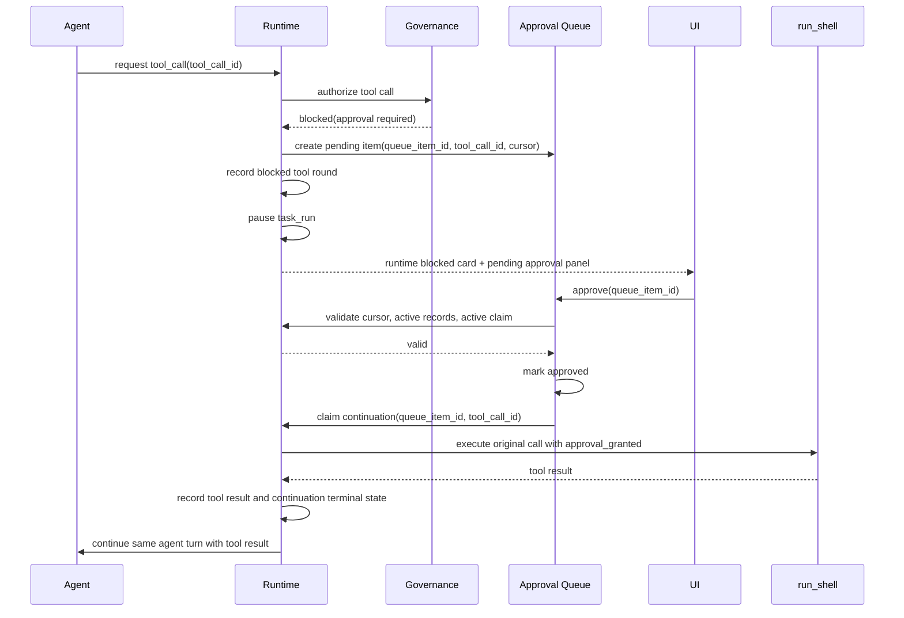
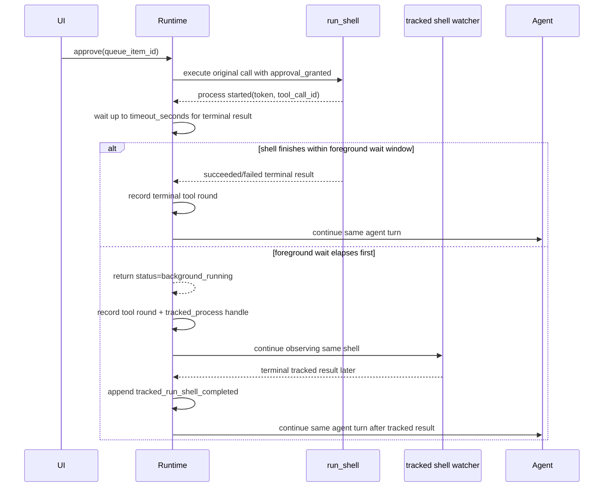
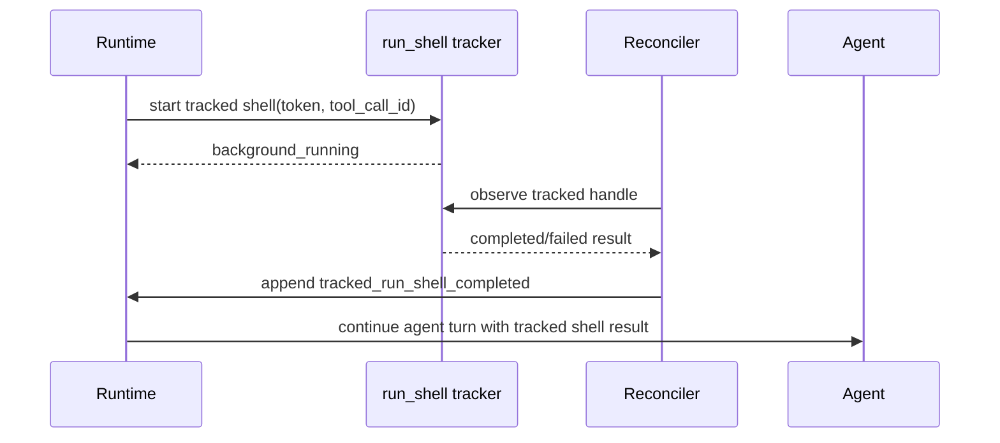

# ADR-023: Execution and Authorization Timing

**Status**: Proposed  
**Date**: 2026-05-22  
**Decision makers**: BOSS + Catown Runtime

**Related**:
- [ADR-019: Canonical Chat Timeline](./ADR-019-canonical-chat-timeline.md)
- [ADR-020: Prompt Guidance vs Runtime Contracts](./ADR-020-prompt-vs-runtime-contracts.md)
- [ADR-021: User-Visible Runtime Step Projection](./ADR-021-user-visible-runtime-step-projection.md)
- [ADR-022: Tester Runner Contract](./ADR-022-tester-runner-contract.md)

## Context

Catown currently has several chains that touch the same visible behavior:

- runtime tool calls create chat/runtime cards;
- tool governance can block a call and create an approval queue item;
- the approval queue API resolves approve/reject actions;
- `run_shell` can also be tracked in the background and reconciled later;
- task-run events and projections render the user-visible state.

These chains are legitimate, but their timing boundaries were not explicit enough. The
result is that a single blocked shell command can look like "approval did not work" even
when the approval flag was accepted and the shell command executed.

The WSL incident that motivated this ADR had this shape:

- queue item `6` for task run `20` was approved and the command
  `/home/sun/.catown/venv/bin/python3 -m pytest ...` was executed;
- queue item `7` for the same task run remained pending because `approve` returned
  `409 Conflict`;
- a tracked `run_shell` reconciliation path later treated the approval-continuation
  result as an ordinary tracked shell completion and drove a second follow-up;
- that second follow-up created or encountered another blocked shell while a previous
  tracked shell/continuation was still active, so later approve attempts were correctly
  rejected before resolution.

The root problem was therefore not "the approval flag was not applied." It was a timing
and ownership bug between approval continuation and tracked shell reconciliation.

## Decision

Authorization is a runtime state transition, not a generic replay shortcut.

When a tool call is blocked by authorization, the runtime pauses at that concrete tool
call. Approving the queue item continues that same tool call exactly once, under the
same runtime ownership and cursor. The approve path must validate that the cursor is
still current before it resolves the queue item. If validation fails, the queue item
stays pending and the API returns `409 Conflict`.

Approval continuation and tracked `run_shell` reconciliation are separate chains. They
may observe the same shell fact, but only one chain may drive the next agent turn for a
given blocked `tool_call_id`.

The term "replay" should not be used for the user-facing authorization path. The user
semantics are:

1. the task pauses because authorization is required;
2. the user approves the pending authorization item;
3. the runtime continues the original tool call;
4. the agent turn continues from that tool result.

No compatibility path for old cursorless approval data is required by this ADR.

## Timing Contract

### Approval-blocked tool call

Required properties:

- A pending approval item pauses the owning task run.
- Approve validates current continuation state before marking the item resolved.
- Approve resolving the queue item removes it from pending approval panels.
- Approve does not delete or rewrite the original runtime blocked card. That card is an
  audit/runtime fact in the chat history.
- The continued tool call must carry an explicit "authorization granted" runtime fact.
- The continued tool result must be written back through the normal tool-round ledger.

### Approved `run_shell` with foreground wait window

When the blocked tool is `run_shell`, approval does not imply "wait forever in the same
turn." The runtime may continue the original shell call and still stop synchronously
waiting after a bounded foreground window such as `timeout_seconds=5`.

That foreground window is a runtime responsiveness boundary, not a process-kill
deadline. Its job is to let short commands complete inline while allowing long commands
to continue as tracked background work without holding the same agent/tool turn open.

Required properties:

- `approval_blocked` means the concrete blocked shell call has not executed yet. The
  process starts only after approval continuation actually runs.
- `timeout_seconds` bounds synchronous waiting in the current runtime turn. It does not
  mean "kill the shell after N seconds."
- `background_running` is a non-terminal tool result meaning the same `run_shell`
  invocation is still executing under a tracked handle.
- When `background_running` is recorded, the current tool round may be complete even
  though the shell process is still running. These are different layers of state.
- It is therefore valid for the UI or task activity view to show both:
  - `Agent completed a tool round.`
  - `Agent running run_shell.`
- Those two facts are not contradictory. The first means the current LLM/tool exchange
  ended. The second means the tracked subprocess for that same tool call is still
  executing.
- Agent follow-up after `background_running` must wait for a later terminal tracked
  result. The runtime must not treat `background_running` itself as final evidence.

### Tracked background shell

Tracked shell reconciliation owns the follow-up only when the shell result was not
already consumed by an approval continuation for the same `tool_call_id`.

### Prohibited duplicate path

The following path is invalid:

1. approval continuation executes a blocked `run_shell`;
2. the continuation records a terminal result for `tool_call_id=A`;
3. tracked-shell reconciliation later observes the same result;
4. reconciliation treats it as a fresh ordinary tracked completion;
5. reconciliation drives a second agent follow-up for `tool_call_id=A`.

This creates duplicate model turns and can produce repeated approval items. The runtime
must dedupe across the approval-continuation chain and the tracked-shell chain using the
blocked tool identity, not only a tracker token that may change across execution modes.

## Ownership and Idempotency Keys

The following identifiers have different jobs and must not be substituted for each other:

- `queue_item_id`: identifies the pending authorization decision.
- `tool_call_id`: identifies the concrete model-requested tool call that was blocked.
- tracked shell token/process id: identifies the process handle observed by the
  background tracker.
- continuation claim/request key: identifies one attempt to continue after approval.
- `task_run_id`: identifies the owning run and lifecycle state.

Cross-chain dedupe must include `tool_call_id`. A queue item can be approved only for
the current blocked cursor. A tracked shell can drive follow-up only if the same
`tool_call_id` has not already been consumed by approval continuation.

## `409 Conflict` Semantics

`POST /api/approval-queue/{id}/approve` returning `409 Conflict` means the item was not
resolved. The pending queue item must remain visible because the runtime rejected the
transition before approval was applied.

Valid reasons include:

- the queue item is no longer the current continuation cursor;
- another continuation claim is active for the same blocked call;
- another tracked `run_shell` record is still active and would make continuation unsafe;
- the queue item points at stale or mismatched runtime state.

`409` is not a frontend dismissal signal. The UI should surface the conflict reason and
continue showing the pending item until the backend resolves, rejects, or supersedes it.

## UI Placement

Catown has two different visible surfaces:

- Runtime tool-call cards render in the chat/runtime history. They show that a concrete
  tool call was requested, blocked, continued, completed, or failed.
- Approval queue panels render as pending authorization controls for the current task or
  monitor surface. They show unresolved decisions the user can act on.

Resolving an approval queue item should remove the approval queue panel. It should not
remove the original runtime blocked card, because that card is part of the execution
history. A later continuation/completion card or task projection can explain what
happened after approval.

For `run_shell`, a later background-running card or process projection may legitimately
remain visible after the approval panel disappears. Approval resolution and shell
completion are different facts and may happen at different times.

## Consequences

1. Approval code should be named around continuation, not replay, on the user-facing and
   runtime-policy path. Internal helpers may be migrated incrementally, but new concepts
   should use continuation language.
2. Approve must validate before resolution. Marking the item approved first and trying
   to repair execution later can hide real cursor bugs.
3. Tracked shell reconciliation must check approval-continuation consumption before
   dispatching a follow-up model turn.
4. Duplicate approvals must be fixed by runtime ownership and idempotency, not by hiding
   repeated queue items in the frontend.
5. Task pause/running transitions are runtime facts. Prompt instructions cannot be the
   source of truth for authorization timing.

## Non-goals

- This ADR does not change the read-only allowlist or shell permission policy.
- This ADR does not define a compatibility layer for old approval items without a valid
  continuation cursor.
- This ADR does not make the frontend silently discard duplicate approval items.
- This ADR does not merge runtime cards and approval queue panels into one UI component.
- This ADR does not replace the broader canonical timeline and task activity projection
  work from ADR-019 and ADR-021.

## Follow-up Work

- Rename remaining user-facing `replay` labels in the authorization path to
  `continue`/`continuation`.
- Make approve conflict reasons visible enough in chat and monitor that a `409` can be
  diagnosed without reading server logs.
- Continue consolidating approval request shapes under the runtime action request
  contract.
- Add regression tests for approval continuation versus tracked shell reconciliation
  using `tool_call_id` as the cross-chain dedupe key.
