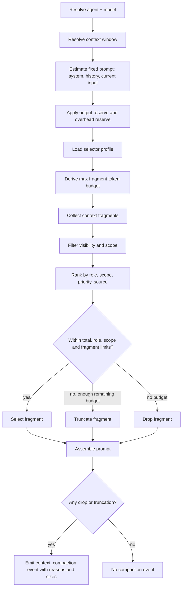

# ADR-026: Dynamic Context Control and Compaction Trigger Flow

**Status**: Accepted  
**Date**: 2026-05-23  
**Decision maker**: BOSS  
**Related**: ADR-009 Context Compression, ADR-012 LLM Session Context Management, ADR-010 Monitoring Audit Visualization, ADR-020 Prompt Guidance vs Runtime Contracts

---

## 1. Context

Catown now has a runtime context selector in `backend/services/context_builder.py` and configurable selector profiles in `backend/services/chat_prompt_builder.py`.

The current implementation already supports:

- `ContextSelector.for_context_window(...)`: derives a fragment budget from the active model context window, fixed system prompt, recent history, current input and reserved completion tokens.
- Selector profiles: `chat_interactive`, `fallback_chat`, `consult_agent`, stored as defaults and overrideable through `agents.json` under `context.selector_profiles`.
- Fragment controls: `max_fragments`, `max_tokens_cap`, `max_tokens_by_role`, `max_tokens_by_scope`, `truncate_to_budget`, `min_tokens_for_truncation`.
- Compaction diagnostics: `context_compaction` task-run events include `reasons`, `prompt_total`, `prompt_components`, `prompt_fragments`, candidate/selected counts and token estimates.
- Monitor visibility: `Monitor -> Compactions` shows compaction events, trigger reasons, prompt module sizes and selected fragment sizes.

The missing architectural rule is how to decide the budget when the model window is large, unknown, provider-specific or changes over time. A fixed "200K context" policy is not acceptable because model context sizes differ and are mutable.

---

## 2. Decision

Catown will treat the model context window as a dynamic runtime property, not as a hard-coded product constant.

The compaction trigger flow is:

1. Resolve the active model id.
2. Resolve its real context window from local model metadata first.
3. If the model is an OpenAI GPT model and local metadata is absent or suspicious, use current official OpenAI model documentation as the reference when updating config.
4. Derive a safe input budget from the resolved window.
5. Apply selector profile caps as upper bounds.
6. Rank fragments by role, scope and priority.
7. Select, truncate or drop fragments.
8. Emit `context_compaction` only when selection changed content through truncation or dropping.
9. Persist reason and size diagnostics for Monitor.

This ADR defines the trigger policy, not a new compression algorithm. Output filtering and tool-result summarization remain governed by ADR-009.

---

## 3. Model Context Window Resolution

### 3.1 Resolution Order

Runtime code should resolve context window in this order:

1. Agent runtime registry metadata, e.g. `registered_agent.get_model_info(model_id).context_window`.
2. Agent-specific provider config in `agents.json`: `agents[agent].provider.models[].contextWindow`.
3. Global provider config in `agents.json`: `global_llm.provider.models[].contextWindow`.
4. Any other configured agent provider entry with the same model id.
5. Provider/model registry adapter, when implemented.
6. Conservative fallback.

Current code already implements most of this in:

- `backend/routes/api.py::_resolve_llm_context_window(...)`
- `backend/pipeline/engine.py::_get_agent_context_window(...)`
- `backend/agents/config_models.py::ModelConfig.contextWindow`

### 3.2 Official Model Reference Is Not a Runtime Constant

For OpenAI GPT models, Catown should update local `contextWindow` from official OpenAI documentation when the configured model is known but the local window is missing or clearly stale.

As of 2026-05-23, official OpenAI pages indicate:

| Model family | Official context reference |
| --- | --- |
| GPT-5 / GPT-5 mini / GPT-5 nano API family | 400,000 total context, with 272,000 input tokens and 128,000 reasoning/output tokens in developer documentation |
| GPT-5.2 compare page | 400,000 context window |
| GPT-4.1 API family | 1,047,576 context window |

These values must be treated as reference data for config refresh, not hard-coded into `ContextSelector`.

If the provider is OpenAI-compatible but not OpenAI, Catown must trust the configured `contextWindow` unless a provider-specific adapter exists.

---

## 4. Budget Derivation

Given:

```text
W = resolved model context window
S = estimated fixed system/developer base prompt tokens
H = estimated recent history tokens
I = estimated current input/protocol tokens
O = reserved completion/reasoning/output tokens
E = prompt overhead and token-estimation error reserve
P = selector profile max_tokens_cap, if configured
```

The selector budget is:

```text
raw_available = W - O - S - H - I - E
profile_budget = min(raw_available, P) if P exists else raw_available
fragment_budget = max(profile_budget, emergency_floor)
```

Current code maps this through `ContextSelector.for_context_window(...)`, where:

- `W` is `context_window`
- `S` is `base_system_prompt`
- `H` is `history_messages`
- `I` is `current_input_messages`
- `O` is `reserved_completion_tokens` or `_default_completion_reserve(context_window)`
- `E` is `prompt_overhead_tokens`
- `P` is profile `max_tokens_cap`

### 4.1 Safe Input Bands

For long-context models, Catown should not fill the window just because it can.

Recommended bands:

| Band | Prompt usage versus resolved window | Behavior |
| --- | ---: | --- |
| Green | <= 55% | Normal selection. No proactive summarization. |
| Yellow | 55%-70% | Prefer summaries over raw tool output; truncate low-priority fragments. |
| Orange | 70%-82% | Apply strict scope budgets; drop low-priority runtime/tool fragments. |
| Red | > 82% | Force compact mode; only task goal, active constraints, current turn, durable decisions and compact summaries survive. |

For GPT-5 API's 400K total context, the practical input side is 272K according to OpenAI's developer guidance. Catown should therefore derive from the input allowance when a model exposes separate input/output limits; otherwise use total context minus output reserve.

For GPT-4.1's 1,047,576 context window, Catown should still default to a lower effective prompt target for interactive chat, because larger prompts increase cost, latency and attention dilution.

---

## 5. Selector Profile Policy

Selector profiles are not absolute model limits. They are product behavior limits.

Default profile intent:

| Profile | Purpose | Budget style |
| --- | --- | --- |
| `chat_interactive` | User-facing chat turn | Lower latency, preserve current turn and task state. |
| `fallback_chat` | Recovery/fallback chat path | Smaller budget, robust under degraded config. |
| `consult_agent` | Side consult or helper agent | Smallest budget, focused handoff. |
| future `background_deep` | Long background analysis | Larger budget, slower and more expensive. |

For large-context models, profile caps should be computed or configured as percentages:

```text
interactive_cap = min(0.45 * input_window, configured_profile_cap)
background_cap  = min(0.65 * input_window, configured_profile_cap)
hard_ceiling    = 0.75 * input_window
```

If no explicit `max_tokens_cap` is configured, Catown may derive one from the profile class. If an explicit cap exists, it wins as an upper bound.

---

## 6. Compaction Trigger Flow



### 6.1 Trigger Reasons

`context_compaction.reasons` must be structured and stable:

| Reason kind | Meaning |
| --- | --- |
| `max_fragments` | Candidate fragment count exceeded `max_fragments`. |
| `max_tokens` | Candidate fragment tokens exceeded derived or configured total fragment budget. |
| `role_tokens` | Candidate tokens for `developer` or `user` exceeded role budget. |
| `scope_tokens` | Candidate tokens for a scope, such as `turn` or `agent_private`, exceeded scope budget. |
| `truncated` | One or more selected fragments were shortened. |
| `dropped` | One or more candidate fragments were omitted. |

Monitor should display the structured reason first and the legacy `detail_summary` only as fallback.

---

## 7. Scope Budget Defaults

Scopes are not equal. For an interactive coding turn, the priority order is:

1. Current input and protocol tail.
2. System/developer identity and non-negotiable runtime contract.
3. Current task state, validation criteria and blocking approvals.
4. Current turn facts and recent tool results.
5. Run-level project status and decisions.
6. Stage context.
7. Shared facts.
8. Agent-private memory.
9. Older raw tool outputs.

Suggested proportional budget for `chat_interactive`:

| Scope | Share of fragment budget |
| --- | ---: |
| `turn` | 28%-35% |
| `run` | 25%-35% |
| `stage` | 10%-18% |
| `session` | 3%-6% |
| `shared_fact` | 3%-6% |
| `agent_private` | 5%-10% |

Developer role should normally receive 15%-25% of fragment budget. User/context role should receive 75%-85%.

The current small defaults in `chat_prompt_builder.py` are intentionally conservative and suitable for low-latency runs. They should be migrated to percentage-derived defaults once model metadata is trusted enough.

---

## 8. Observability Contract

Every compaction event must expose:

- `reasons`: structured trigger reasons.
- `reason_summary`: short human-readable reason string.
- `prompt_total`: bytes, estimated tokens, message count for final assembled prompt.
- `prompt_components`: system, developer, user_context, history, current_input sizes.
- `prompt_fragments`: selected fragment role/scope/source/priority/token/byte sizes.
- `candidate_tokens` and `selected_tokens`.
- `candidate_count` and `selected_count`.
- `dropped_count` and `truncated_count`.
- `max_tokens`, `max_fragments`, `max_tokens_by_role`, `max_tokens_by_scope`.

Monitor must allow BOSS to answer:

1. Why was context compacted?
2. Which budget was exceeded?
3. Which module consumed most of the prompt?
4. Which fragments were dropped or truncated?
5. Was this due to model window limits, product profile limits, or scope/role budgets?

---

## 9. Implementation Plan

### Phase 1: Documented dynamic policy

- Add this ADR.
- Keep existing selector behavior.
- Continue using explicit `contextWindow` from config.

### Phase 2: Model metadata refresh

- Add a provider metadata adapter for OpenAI model ids.
- Allow Settings to refresh or validate `contextWindow` for known OpenAI models.
- Mark manually configured windows as user overrides.

### Phase 3: Percentage-derived profiles

- Extend `context.selector_profiles` to support either absolute values or percentage expressions:

```json
{
  "max_tokens_cap_ratio": 0.45,
  "max_tokens_by_scope_ratio": {
    "turn": 0.32,
    "run": 0.30,
    "stage": 0.14,
    "session": 0.04,
    "shared_fact": 0.04,
    "agent_private": 0.08
  }
}
```

- Materialize ratios into absolute token budgets at prompt assembly time.

### Phase 4: Proactive summarization

- When usage enters Orange or Red band, request compact summaries for old tool outputs and old turn state before fragment selection.
- Persist original full payload outside the prompt path.
- Do not silently summarize current user input or non-negotiable developer/runtime contract.

---

## 10. Consequences

Positive:

- Catown can adapt to 128K, 200K, 400K and 1M-token models without code changes.
- Monitor can explain compaction with concrete model/profile/scope reasons.
- Product behavior remains stable even when providers advertise very large windows.

Tradeoffs:

- Requires accurate local model metadata.
- Percentage-derived budgets add configuration complexity.
- Official provider model data can change, so config refresh must be explicit and auditable.

Non-goals:

- This ADR does not require filling every available token.
- This ADR does not replace ADR-009 output filtering.
- This ADR does not introduce KV-cache compression or inference-layer changes.

