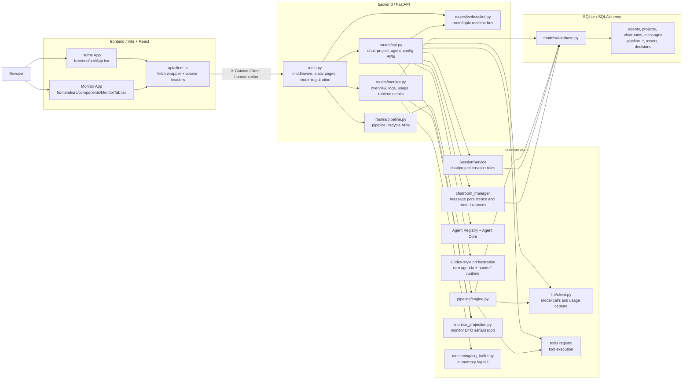
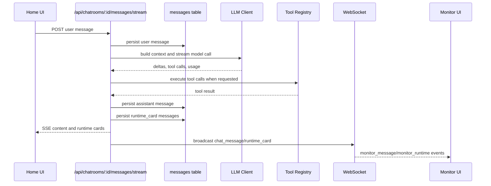
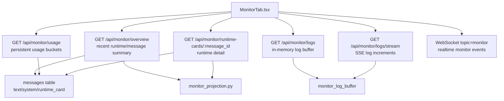

# Catown Logic Architecture

Updated: 2026-04-22

This document describes the current project logic architecture as implemented in the codebase. It focuses on runtime boundaries, data flow, persistence, and the Monitor projection layer.

Network monitor semantics and the default aggregated-vs-stream debugging rule are defined in [ADR-014](ADR-014-network-monitor-semantics.md).

## 1. System Overview

Catown is currently a single FastAPI backend serving two React/Vite frontend entry points:

- Home: the main product UI, mounted from `frontend/src/App.tsx`.
- Monitor: the standalone observability UI, mounted from `frontend/src/components/MonitorTab.tsx`.

Both frontends call the same backend API. The frontend API client attaches `X-Catown-Client` so backend logs can distinguish requests from `home`, `monitor`, tests, health checks, or other callers.

## 2. Runtime Boundaries

### Frontend

The frontend has two Vite inputs:

- `frontend/index.html` loads `frontend/src/main.tsx`, which renders `App`.
- `frontend/monitor.html` loads `frontend/src/monitor.tsx`, which renders `MonitorTab`.

`frontend/src/api/client.ts` is the shared HTTP client. It:

- Sends `Content-Type: application/json`.
- Sends `X-Catown-Client`, inferred from the current path.
- Sends `X-Catown-UI-Version`.
- Disables request caching with `cache: "no-store"`.
- Handles server UI-version response headers.

### Backend

`backend/main.py` owns process-level setup:

- FastAPI application creation.
- CORS configuration.
- Rate limit middleware.
- Request logging middleware.
- Static frontend serving for `/` and `/monitor`.
- Database initialization.
- Built-in agent registration.
- Router registration.
- WebSocket endpoint at `/ws`.

Main route groups:

- `routes/api.py`: primary application APIs for chats, projects, agents, config, tools, and chat execution.
- `routes/monitor.py`: read-side Monitor APIs.
- `routes/pipeline.py`: pipeline lifecycle and workspace APIs.
- `routes/audit.py`: audit-related APIs.
- `routes/websocket.py`: shared realtime connection manager.

## 3. Chat Execution Flow

The primary chat flow is centered in `routes/api.py`.

Multi-agent chat execution is evolving toward a Codex-style orchestration runtime:

- `@mention` creates a short-lived turn agenda instead of entering a fixed project pipeline.
- Each agent turn rebuilds prompt context from `TurnContextState`.
- Prior work is passed forward as handoff/inbox context, not by endlessly appending transcript.
- The legacy `pipeline/engine.py` remains available for explicit governance workflows, but it is no longer the preferred default for chat collaboration.

Important details:

- Normal chat messages and runtime cards are both stored in the `messages` table.
- Runtime cards use `message_type = "runtime_card"` and store the card payload in `metadata_json.card`.
- LLM runtime cards include token usage fields when provided by the model response.
- Tool runtime cards include tool name, arguments preview/result, success, and duration data.
- Chat turns now also persist a run-level ledger in `task_runs` / `task_run_events` so each sync/SSE execution has ordered mode-selection, turn, tool, handoff, and failure events.
- `services/monitor_projection.py` converts persisted messages/runtime cards into Monitor-friendly DTOs.

## 4. Monitor Read Model

Monitor is a read-side projection over existing runtime state. It does not own a separate backend service and does not drive primary execution.

Monitor currently combines these sources:

- Persisted runtime cards from `messages`.
- Persisted normal messages from `messages`.
- Realtime WebSocket topic events from `monitor`.
- Access/application logs from `monitor_log_buffer`.
- Frontend-local rendering state for filters, selected page, chart range, and expanded runtime details.

## 5. Usage Persistence

Usage data is persisted indirectly through runtime cards:

- LLM calls create runtime cards with `type = "llm_call"`.
- Those runtime cards are stored as rows in `messages`.
- Token input/output values are stored inside `metadata_json.card`.
- `GET /api/monitor/usage` scans persisted runtime cards and aggregates usage by system wall-clock time.

Current usage aggregation supports:

- `1h`: 12 buckets of 5 minutes.
- `6h`: 6 hourly buckets.
- `24h`: 24 hourly buckets.
- `7d`: 7 daily buckets.
- `30d`: 30 daily buckets.
- Day/week/month totals.
- Estimated cost based on current static input/output token pricing constants.

This means usage survives page refreshes and backend restarts as long as the underlying database persists. It is not currently stored in a dedicated usage table; it is derived from persisted runtime cards.

## 6. Persistence Model

Core SQLAlchemy models live in `backend/models/database.py`.

Primary user/session tables:

- `agents`: agent definitions.
- `projects`: project containers and workspace metadata.
- `chatrooms`: standalone chats, hidden project chats, and project subchats.
- `messages`: chat messages and runtime cards.
- `task_runs`: per-turn orchestration ledger headers for sync and SSE chat execution.
- `task_run_events`: ordered run events such as runtime mode selection, tool rounds, handoffs, and failures.
- `memories`: agent memories.

Pipeline/product tables:

- `pipelines`, `pipeline_runs`, `pipeline_stages`, `pipeline_messages`, `pipeline_message_deliveries`.
- `assets`, `asset_links`.
- `decisions`, `decision_assets`.
- `stage_runs`, `stage_run_assets`.

The most important architectural point is that `messages` is both:

- The chat transcript store.
- The lightweight runtime event store for chat-visible and Monitor-visible execution cards.

In addition, run-level orchestration state is now split out from transcript storage:

- `task_runs` stores one durable execution record per chat turn.
- `task_run_events` stores ordered execution events for that run.
- `GET /api/chatrooms/{id}/task-runs` lists chatroom runs.
- `GET /api/task-runs/{id}` returns ordered ledger detail for debugging and future resume work.

## 7. Request Source Tracking

Request source tracking is implemented cooperatively:

- Frontend sends `X-Catown-Client`.
- Backend request logging middleware reads that header.
- If the header is missing, backend falls back to `referer`.
- If neither identifies a caller, source is `unknown`.

Expected current sources:

- `home`: main UI requests.
- `monitor`: Monitor UI requests.
- `test`: automated tests that set the source header.
- `healthcheck`: health-check scripts.
- `example`: demo/example scripts.
- `unknown`: direct calls, legacy scripts, missing headers, or clients that do not provide enough context.

## 8. Realtime Model

There is one shared WebSocket endpoint at `/ws`.

`WebSocketManager` supports:

- Global active connection tracking.
- Chatroom rooms keyed by `chatroom_id`.
- Generic topics, currently including `monitor`.

Main UI behavior:

- Joins the active chatroom.
- Receives `chat_message` and `runtime_card` events for the selected room.

Monitor behavior:

- Subscribes to the `monitor` topic.
- Receives `monitor_message` and `monitor_runtime` projection events.
- Also uses REST and SSE for initial snapshots and log streaming.

## 9. Architectural Takeaways

- Home and Monitor are separate frontend entry points but share one backend and one database.
- Monitor is a projection/read model, not an execution path.
- Runtime observability is currently centered on persisted runtime cards in the `messages` table.
- Logs are not persisted long term in the database; Monitor logs are an in-memory tail exposed by REST/SSE.
- Usage is now durable enough for long-range charts because it is derived from persisted runtime cards.
- A future dedicated usage/audit table may improve query performance and historical reporting, but the current design avoids duplicating data while runtime-card persistence is still the source of truth.
- Pipeline execution is evolving toward a Codex-style runtime kernel: turn-state prompt rebuild, durable inter-agent inbox entries, and later run-level scheduling/ledger layers.
