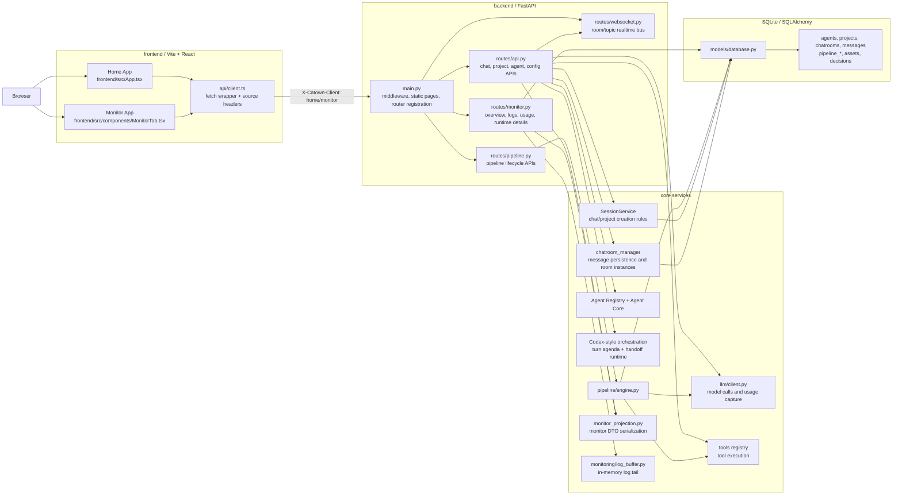
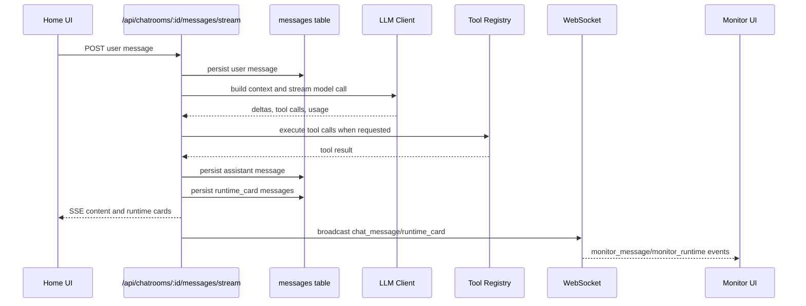
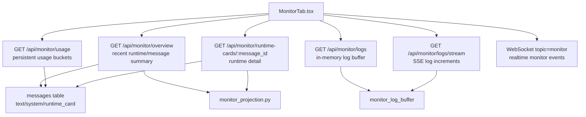

# Catown Logic Architecture

Updated: 2026-04-22

This document describes the current project logic architecture as implemented in the codebase. It focuses on runtime boundaries, data flow, persistence, and the Monitor projection layer.

Network monitor semantics and the default aggregated-vs-stream debugging rule are defined in [ADR-014](ADR-014-network-monitor-semantics.md).

## 1. System Overview

Catown is currently a single FastAPI backend serving two React/Vite frontend entry points:

- Home: the main product UI, mounted from `frontend/src/App.tsx`.
- Monitor: the standalone observability UI, mounted from `frontend/src/components/MonitorTab.tsx`.

Both frontends call the same backend API. The frontend API client attaches `X-Catown-Client` so backend logs can distinguish requests from `home`, `monitor`, tests, health checks, or other callers.


```mermaid
flowchart LR
  User["Browser"]

  subgraph FE["frontend / Vite + React"]
    Home["Home App<br/>frontend/src/App.tsx"]
    Monitor["Monitor App<br/>frontend/src/components/MonitorTab.tsx"]
    ApiClient["api/client.ts<br/>fetch wrapper + source headers"]
  end

  subgraph BE["backend / FastAPI"]
    Main["main.py<br/>middleware, static pages, router registration"]
    ApiRoutes["routes/api.py<br/>chat, project, agent, config APIs"]
    MonitorRoutes["routes/monitor.py<br/>overview, logs, usage, runtime details"]
    PipelineRoutes["routes/pipeline.py<br/>pipeline lifecycle APIs"]
    WS["routes/websocket.py<br/>room/topic realtime bus"]
  end

  subgraph Core["core services"]
    SessionService["SessionService<br/>chat/project creation rules"]
    ChatroomManager["chatroom_manager<br/>message persistence and room instances"]
    Agents["Agent Registry + Agent Core"]
    LLM["llm/client.py<br/>model calls and usage capture"]
    Tools["tools registry<br/>tool execution"]
    Orchestrator["Codex-style orchestration<br/>turn agenda + handoff runtime"]
    PipelineEngine["pipeline/engine.py"]
    Projection["monitor_projection.py<br/>monitor DTO serialization"]
    LogBuffer["monitoring/log_buffer.py<br/>in-memory log tail"]
  end

  subgraph DB["SQLite / SQLAlchemy"]
    Models["models/database.py"]
    Tables["agents, projects, chatrooms, messages<br/>pipeline_*, assets, decisions"]
  end

  User --> Home
  User --> Monitor
  Home --> ApiClient
  Monitor --> ApiClient

  ApiClient -->|"X-Catown-Client: home/monitor"| Main
  Main --> ApiRoutes
  Main --> MonitorRoutes
  Main --> PipelineRoutes
  Main --> WS

  ApiRoutes --> SessionService
  ApiRoutes --> ChatroomManager
  ApiRoutes --> Agents
  ApiRoutes --> LLM
  ApiRoutes --> Tools
  ApiRoutes --> Orchestrator
  ApiRoutes --> Projection
  ApiRoutes --> WS

  MonitorRoutes --> Models
  MonitorRoutes --> Projection
  MonitorRoutes --> LogBuffer

  PipelineRoutes --> PipelineEngine
  PipelineEngine --> LLM
  PipelineEngine --> Tools
  PipelineEngine --> Models

  SessionService --> Models
  ChatroomManager --> Models
  Models --> Tables
```

## 2. Runtime Boundaries

### Frontend

The frontend has two Vite inputs:

- `frontend/index.html` loads `frontend/src/main.tsx`, which renders `App`.
- `frontend/monitor.html` loads `frontend/src/monitor.tsx`, which renders `MonitorTab`.

`frontend/src/api/client.ts` is the shared HTTP client. It:

- Sends `Content-Type: application/json`.
- Sends `X-Catown-Client`, inferred from the current path.
- Sends `X-Catown-UI-Version`.
- Disables request caching with `cache: "no-store"`.
- Handles server UI-version response headers.

### Backend

`backend/main.py` owns process-level setup:

- FastAPI application creation.
- CORS configuration.
- Rate limit middleware.
- Request logging middleware.
- Static frontend serving for `/` and `/monitor`.
- Database initialization.
- Built-in agent registration.
- Router registration.
- WebSocket endpoint at `/ws`.

Main route groups:

- `routes/api.py`: primary application APIs for chats, projects, agents, config, tools, and chat execution.
- `routes/monitor.py`: read-side Monitor APIs.
- `routes/pipeline.py`: pipeline lifecycle and workspace APIs.
- `routes/audit.py`: audit-related APIs.
- `routes/websocket.py`: shared realtime connection manager.

## 3. Chat Execution Flow

The primary chat flow is centered in `routes/api.py`.

Multi-agent chat execution is evolving toward a Codex-style orchestration runtime:

- `@mention` creates a short-lived turn agenda instead of entering a fixed project pipeline.
- Each agent turn rebuilds prompt context from `TurnContextState`.
- Prior work is passed forward as handoff/inbox context, not by endlessly appending transcript.
- The legacy `pipeline/engine.py` remains available for explicit governance workflows, but it is no longer the preferred default for chat collaboration.


```mermaid
sequenceDiagram
  participant Home as Home UI
  participant API as /api/chatrooms/:id/messages/stream
  participant DB as messages table
  participant LLM as LLM Client
  participant Tools as Tool Registry
  participant WS as WebSocket
  participant Monitor as Monitor UI

  Home->>API: POST user message
  API->>DB: persist user message
  API->>LLM: build context and stream model call
  LLM-->>API: deltas, tool calls, usage
  API->>Tools: execute tool calls when requested
  Tools-->>API: tool result
  API->>DB: persist assistant message
  API->>DB: persist runtime_card messages
  API-->>Home: SSE content and runtime cards
  API->>WS: broadcast chat_message/runtime_card
  WS-->>Monitor: monitor_message/monitor_runtime events
```

Important details:

- Normal chat messages and runtime cards are both stored in the `messages` table.
- Runtime cards use `message_type = "runtime_card"` and store the card payload in `metadata_json.card`.
- LLM runtime cards include token usage fields when provided by the model response.
- Tool runtime cards include tool name, arguments preview/result, success, and duration data.
- Chat turns now also persist a run-level ledger in `task_runs` / `task_run_events` so each sync/SSE execution has ordered mode-selection, turn, tool, handoff, and failure events.
- `services/monitor_projection.py` converts persisted messages/runtime cards into Monitor-friendly DTOs.

## 4. Semantic-vs-Control Boundary

Catown now needs a clearer vocabulary for separating LLM-driven judgment from software-driven control.

The most useful distinction is not "who is making a decision", because both the LLM side and the software side do make decisions. The useful distinction is:

- whether the decision is semantic and content-shaped
- or whether it is runtime-shaped, declarative, and recoverable

The current system is best understood through four layers:

### 4.1 Runtime Policy

Owner: local software

Purpose:

- lifecycle legality
- state transitions
- approval blocking
- timeout / lease / recovery
- child handle wait / cancel / close
- checkpoint and replay

Representative modules:

- `backend/services/run_ledger.py`
- `backend/routes/api.py`
- `backend/services/subagent_lifecycle.py`
- `backend/services/approval_queue.py`
- `backend/services/approval_replay.py`
- orchestration recovery / guards / events / inbox services

Typical questions answered here:

- Can this run resume now?
- Can this handle be cancelled or closed?
- Must this stage block on approval?
- Did recovery ownership expire?
- Did this wait call time out?

This layer should be deterministic, auditable, and rebuildable from persisted state.

### 4.2 Workflow Spec

Owner: LLM may generate or adapt it; local software executes it

Purpose:

- project-specific workflow shape
- stage ordering
- stage ownership
- gate configuration
- expected artifacts
- rollback targets
- timeout budgets

Representative modules and files:

- `backend/configs/pipelines.json`
- `backend/pipeline/engine.py`
- `backend/pipeline/config.py`

The default software-delivery workflow currently defined in the repo is:

1. `analysis` -> `analyst` -> `gate=manual`
2. `architecture` -> `architect` -> `gate=auto`
3. `development` -> `developer` -> `gate=auto`
4. `testing` -> `tester` -> `gate=auto`, may rollback to `development`
5. `release` -> `release` -> `gate=manual`

This layer is where project-type variation should live. A software project, a UI-design project, or a video-generation project should mainly differ here, not in Runtime Policy.

### 4.3 Evaluation Rubric

Owner: LLM agent, sometimes human-reviewed

Purpose:

- output quality judgment
- semantic completeness
- architectural soundness
- implementation adequacy
- blocker identification
- style, taste, and quality interpretation

Representative LLM-driven roles from the current repo:

- `analyst`
- `architect`
- `developer`
- `tester`
- `release`

Representative config source:

- `backend/configs/agents.json`

Representative contract:

- [Evaluation Rubric Schema v1](Schema-Evaluation-Rubric-v1.md)

Examples:

- whether a PRD is complete enough
- whether a design is over-engineered
- whether code follows the spec
- whether a test finding should count as a blocker
- whether a release summary is acceptable

This is where ambiguous or taste-heavy judgments belong. Local software may carry the review process, but should not pretend to be the semantic judge.

### 4.4 Final Approval

Owner: human today, future user-twin agent possible

Purpose:

- high-risk approval
- high-preference judgment
- explicit authorization boundary
- final release/go-no-go

Representative examples in the current default pipeline:

- `analysis.gate = manual`
- `release.gate = manual`

This layer is carried by software, but not owned by software:

- software pauses
- software records
- software resumes
- the approver decides

### 4.5 Current Boundary in Real Modules

The current repo already reflects this split, even if the terminology was not previously explicit:

- `analyst / architect / developer / tester / release`
  own semantic and quality judgment, and produce artifacts
- `pipeline engine + orchestration runtime + run ledger + control API`
  own execution legality, progression, interruption, recovery, and observability

In short:

- Agents decide what the output means and whether it is good
- Software decides whether the workflow may proceed and how it is controlled

### 4.6 Executor-vs-Orchestrator-vs-Worker Contract

The cleanest current mental model is a three-party contract:

1. local software executor
2. orchestration agent
3. worker agent

The key is that these parties do not exchange arbitrary code or unconstrained scripts.
They exchange bounded specs, artifacts, and action requests.

#### Local Software Executor

Owner: local software

Role:

- interpret bounded workflow/control specs
- enforce lifecycle legality
- own runtime state transitions
- checkpoint, replay, approval, timeout, lease, wait/cancel/close
- route work to the next agent or stage

Typical inputs:

- workflow spec
- current runtime state
- child-handle state
- human approval results
- artifacts from worker agents
- action requests from worker agents

Typical outputs:

- next runnable stage or agent
- blocked / resumed / cancelled / completed status transitions
- checkpoint snapshots
- run ledger events
- updated handle control state

Representative modules:

- `backend/pipeline/engine.py`
- `backend/services/run_ledger.py`
- `backend/routes/api.py`
- orchestration runtime / recovery services

#### Orchestration Agent

Owner: LLM

Role:

- translate a business goal into executable workflow shape
- choose or adapt roles, stage flow, handoff structure, and evaluation criteria
- produce bounded execution specs instead of directly mutating runtime state

Typical inputs:

- user goal
- project context
- existing artifacts
- existing workflow template
- prior decisions and constraints

Typical outputs:

- workflow spec fragments
- stage/role plan
- routing suggestions
- evaluation rubric suggestions
- requests for clarification or approval

Important constraint:

- orchestration agents should not directly own checkpoint legality, leases, or lifecycle transitions
- they propose structure; software executes structure

#### Worker Agent

Owner: LLM

Role:

- perform stage-local semantic work
- produce artifacts
- emit bounded requests back to the software executor

Typical inputs:

- stage context
- prior artifacts
- role prompt and skills
- current workflow/rubric constraints

Typical outputs:

- business artifacts
  - `PRD.md`
  - `tech-spec.md`
  - `src/`
  - `test_report.md`
  - `CHANGELOG.md`
- action requests
  - tool use
  - ask another role
  - suggest rollback
  - report blocker
  - request approval

Important constraint:

- worker agents do not directly advance the runtime
- they produce outputs and requests
- software decides whether those requests actually change control state

#### Contract Summary

```text
Orchestration Agent
  -> Local Software Executor: bounded execution specs

Worker Agent
  -> Local Software Executor: artifacts + action requests

Local Software Executor
  -> Agents: stage assignments, constraints, runtime context
  -> External callers: observable status, checkpoints, handles, approvals
```

This contract matters because it prevents semantic generation from being confused with runtime control:

- LLMs generate meaning, plans, and artifacts
- software owns legality, persistence, and recoverable execution

### 4.7 Open Semantics, Constrained Protocols, Stable Kernel

The core LLM advantage is openness:

- open-ended input
- open-ended semantic interpretation
- open-ended planning
- open-ended output

The software side should not try to mirror that openness directly.
If the software layer also becomes open-ended in the same sense, it quickly collapses into case-by-case business logic and "one task type, one implementation".

The right strategy is:

- keep semantics open
- compress outputs into bounded protocols
- keep the execution kernel small and stable

In practice this means Catown should avoid treating every new domain as a new software product.
Instead, the backend should behave like a general execution kernel that interprets a limited set of protocol objects.

#### What Should Stay Stable

The software kernel should stabilize the following primitives:

- run / task / handle / artifact / approval / checkpoint identities
- state-machine transitions
  - `start`
  - `pause`
  - `resume`
  - `wait`
  - `cancel`
  - `close`
  - `approve`
  - `reject`
  - `rollback`
- ledger / checkpoint / recovery semantics
- timeout / lease / sandbox / ownership rules
- durable request/response boundaries

These are kernel concerns, not domain concerns.

#### What Should Stay Open

The following should vary mainly as data, config, or plugins:

- workflow spec
- agent roster
- stage definitions
- gate rules
- artifact types
- evaluation rubrics
- tool policies
- domain adapters

This is where software delivery, UI design, video generation, or other future project types should differ.

#### The Four Main Protocol Objects

To avoid one-off implementations, Catown should increasingly converge on four first-class protocol objects:

1. `workflow spec`
   - how a task is organized
   - stages, roles, dependencies, gates, rollback, timeout
2. `action request`
   - what an agent asks the kernel to do
   - use a tool, ask another role, request approval, report blocker, suggest rollback
3. `artifact contract`
   - what was produced and how it is stored, validated, and handed forward
4. `evaluation rubric`
   - how quality, completeness, taste, and semantic adequacy should be judged
   - criteria, scale, evaluator owner, threshold, guidance

This is more robust than loosely saying that the software receives a "script".
The important point is not arbitrary programmability, but bounded interpretability.

#### Architectural Consequence

The backend should increasingly look like:

- a runtime kernel
- a workflow interpreter
- an artifact/request router

and less like:

- a pile of domain-specific applications

If a new project type arrives, the goal should be:

- reuse the same kernel
- change the workflow spec
- change the rubric
- change the adapters

not:

- add a new hard-coded execution path
- add a new task-specific state machine
- add a new bespoke API set

#### Practical Rule

When adding a new capability, the first design question should be:

- can this be expressed as `workflow spec`, `action request`, `artifact contract`, or `evaluation rubric`?

If yes, prefer extending protocols over extending the kernel.
If no, then and only then consider adding a new runtime primitive.

The first concrete draft produced from this principle is:

- [Action Request Schema v1](Schema-Action-Request-v1.md)

The second concrete draft is:

- [Artifact Contract Schema v1](Schema-Artifact-Contract-v1.md)

The third concrete draft is:

- [Workflow Spec Schema v1](Schema-Workflow-Spec-v1.md)

The fourth concrete draft is:

- [Evaluation Rubric Schema v1](Schema-Evaluation-Rubric-v1.md)

These schemas keep workflow structure, runtime intent, produced objects, and semantic judgment as separate protocol objects.

## 4. Monitor Read Model

Monitor is a read-side projection over existing runtime state. It does not own a separate backend service and does not drive primary execution.


```mermaid
flowchart TB
  MonitorPage["MonitorTab.tsx"]

  Overview["GET /api/monitor/overview<br/>recent runtime/message summary"]
  Usage["GET /api/monitor/usage<br/>persistent usage buckets"]
  Logs["GET /api/monitor/logs<br/>in-memory log buffer"]
  LogsStream["GET /api/monitor/logs/stream<br/>SSE log increments"]
  RuntimeDetail["GET /api/monitor/runtime-cards/:message_id<br/>runtime detail"]
  MonitorWS["WebSocket topic=monitor<br/>realtime monitor events"]

  Messages["messages table<br/>text/system/runtime_card"]
  LogBuffer["monitor_log_buffer"]
  Projection["monitor_projection.py"]

  MonitorPage --> Overview
  MonitorPage --> Usage
  MonitorPage --> Logs
  MonitorPage --> LogsStream
  MonitorPage --> RuntimeDetail
  MonitorPage --> MonitorWS

  Overview --> Messages
  Usage --> Messages
  RuntimeDetail --> Messages
  Overview --> Projection
  RuntimeDetail --> Projection
  Logs --> LogBuffer
  LogsStream --> LogBuffer
```

Monitor currently combines these sources:

- Persisted runtime cards from `messages`.
- Persisted normal messages from `messages`.
- Realtime WebSocket topic events from `monitor`.
- Access/application logs from `monitor_log_buffer`.
- Frontend-local rendering state for filters, selected page, chart range, and expanded runtime details.

## 5. Usage Persistence

Usage data is persisted indirectly through runtime cards:

- LLM calls create runtime cards with `type = "llm_call"`.
- Those runtime cards are stored as rows in `messages`.
- Token input/output values are stored inside `metadata_json.card`.
- `GET /api/monitor/usage` scans persisted runtime cards and aggregates usage by system wall-clock time.

Current usage aggregation supports:

- `1h`: 12 buckets of 5 minutes.
- `6h`: 6 hourly buckets.
- `24h`: 24 hourly buckets.
- `7d`: 7 daily buckets.
- `30d`: 30 daily buckets.
- Day/week/month totals.
- Estimated cost based on current static input/output token pricing constants.

This means usage survives page refreshes and backend restarts as long as the underlying database persists. It is not currently stored in a dedicated usage table; it is derived from persisted runtime cards.

## 6. Persistence Model

Core SQLAlchemy models live in `backend/models/database.py`.

Primary user/session tables:

- `agents`: agent definitions.
- `projects`: project containers and workspace metadata.
- `chatrooms`: standalone chats, hidden project chats, and project subchats.
- `messages`: chat messages and runtime cards.
- `task_runs`: per-turn orchestration ledger headers for sync and SSE chat execution.
- `task_run_events`: ordered run events such as runtime mode selection, tool rounds, handoffs, and failures.
- `memories`: agent memories.

Pipeline/product tables:

- `pipelines`, `pipeline_runs`, `pipeline_stages`, `pipeline_messages`, `pipeline_message_deliveries`.
- `assets`, `asset_links`.
- `decisions`, `decision_assets`.
- `stage_runs`, `stage_run_assets`.

The most important architectural point is that `messages` is both:

- The chat transcript store.
- The lightweight runtime event store for chat-visible and Monitor-visible execution cards.

In addition, run-level orchestration state is now split out from transcript storage:

- `task_runs` stores one durable execution record per chat turn.
- `task_run_events` stores ordered execution events for that run.
- `GET /api/chatrooms/{id}/task-runs` lists chatroom runs.
- `GET /api/task-runs/{id}` returns ordered ledger detail for debugging and future resume work.

## 7. Request Source Tracking

Request source tracking is implemented cooperatively:

- Frontend sends `X-Catown-Client`.
- Backend request logging middleware reads that header.
- If the header is missing, backend falls back to `referer`.
- If neither identifies a caller, source is `unknown`.

Expected current sources:

- `home`: main UI requests.
- `monitor`: Monitor UI requests.
- `test`: automated tests that set the source header.
- `healthcheck`: health-check scripts.
- `example`: demo/example scripts.
- `unknown`: direct calls, legacy scripts, missing headers, or clients that do not provide enough context.

## 8. Realtime Model

There is one shared WebSocket endpoint at `/ws`.

`WebSocketManager` supports:

- Global active connection tracking.
- Chatroom rooms keyed by `chatroom_id`.
- Generic topics, currently including `monitor`.

Main UI behavior:

- Joins the active chatroom.
- Receives `chat_message` and `runtime_card` events for the selected room.

Monitor behavior:

- Subscribes to the `monitor` topic.
- Receives `monitor_message` and `monitor_runtime` projection events.
- Also uses REST and SSE for initial snapshots and log streaming.

## 9. Architectural Takeaways

- Home and Monitor are separate frontend entry points but share one backend and one database.
- Monitor is a projection/read model, not an execution path.
- Runtime observability is currently centered on persisted runtime cards in the `messages` table.
- Logs are not persisted long term in the database; Monitor logs are an in-memory tail exposed by REST/SSE.
- Usage is now durable enough for long-range charts because it is derived from persisted runtime cards.
- A future dedicated usage/audit table may improve query performance and historical reporting, but the current design avoids duplicating data while runtime-card persistence is still the source of truth.
- Pipeline execution is evolving toward a Codex-style runtime kernel: turn-state prompt rebuild, durable inter-agent inbox entries, and later run-level scheduling/ledger layers.
